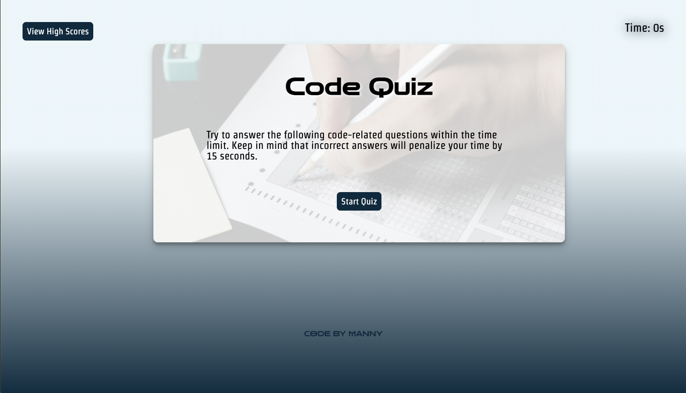

# js-code-quiz-challenge_12-5
Web APIs Challenge: Code Quiz

## Description

Timed quiz created with HTML, CSS and JavaScript. Timer decrements 15 seconds when an incorrect answer is selected. Time left on timer equals user's score. Option for user to save their score to localStorage and shows all high scores with option to clear all scores. 

## Screenshot

## Link to Deployed Application

https://yankeeknight.github.io/js-code-quiz-challenge_12-5/

## Credits

1. "done.jpg" unsplash.com, https://unsplash.com/photos/gI7zgb80QWY 
1. "highscore.jpg" unsplash.com, https://unsplash.com/photos/LTyDj7u_TU4
1. "scantron.jpg" Pexels.com, https://unsplash.com/photos/qDgTQOYk6B8

## Purpose/Usage

Quiz tests JavaScript fundamentals to gauge progress compared to peers

## License

Please refer to the LICENSE in the repo.

---

